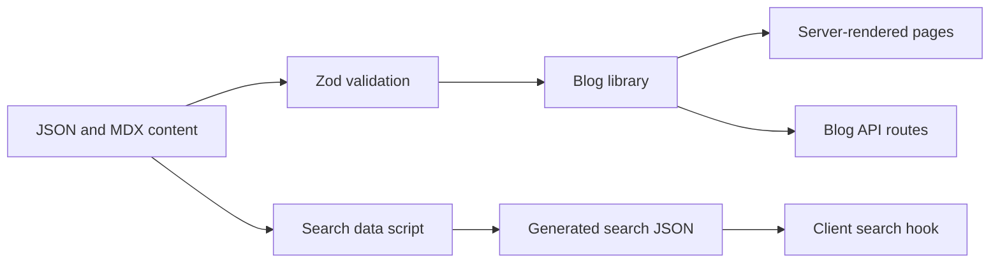
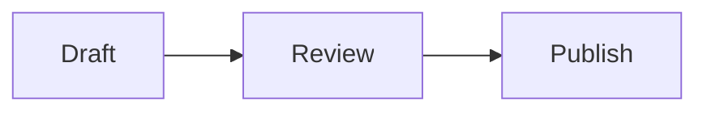

# Yong Cheng Low's website

This repository contains the source for [yongchenglow.com](https://www.yongchenglow.com). It is a file-backed personal website and blog based on Next.js, TypeScript, MDX, and Bun.

## Requirements

- [Bun](https://bun.sh/) 1.4.2 or newer
- Node.js 22.12 or newer for Husky, TypeScript, and Knip command wrappers
- Git

Docker, Helm, and Kubernetes are only needed for container or cluster deployment.

## Get started

```bash
git clone git@github.com:yongchenglow/yongchenglow.com.git
cd yongchenglow.com
bun install
bun run dev
```

Open [http://localhost:3000](http://localhost:3000). The development command generates `public/search-index.json` before it starts Next.js.

No environment variables are required for local development. Advertising is hidden when `NEXT_PUBLIC_GOOGLE_ADSENSE_CLIENT_ID` is unset. Set `NEXT_PUBLIC_GOOGLE_ANALYTICS_TAG_ID` to provide the analytics tag ID.

## Common commands

| Command | Purpose |
| --- | --- |
| `bun run dev` | Generate the search data and start the development server |
| `bun run build` | Generate the search data and create a production build |
| `bun start` | Start an existing production build |
| `bun test` | Run all Bun tests |
| `bun run typecheck` | Check TypeScript types without emitting files |
| `bun run check` | Apply Biome formatting and lint fixes |
| `bun run check:all` | Run TypeScript, Biome, and Knip checks |
| `bun run generate-search-index` | Rebuild `public/search-index.json` |
| `bun run lqip` | Generate low quality image placeholders for blog images |
| `bun run analyze` | Build the app and open the bundle analyzer |

`bun run lint`, `bun run format`, `bun run check`, and `bun run check:ci` can change files. Review their changes before committing.

## Project structure

```text
content/
  authors/                 Author data
  blog/                    Blog posts in MDX
  about.json               About page content
  blog-ui.json             Blog interface labels
  home.json                Home page content
docs/                      API, integration, and feature guides
helm/nextjs-app/           Kubernetes Helm chart
public/                    Static assets and generated search data
scripts/                   Search and image helper scripts
src/
  app/                     Next.js pages, route handlers, metadata, and errors
  components/              Page, feature, shared, and MDX components
  config/                  Site, blog, advertising, and interface configuration
  content/schema.ts        Runtime validation for JSON and MDX data
  hooks/                   Client hooks
  lib/                     Blog, image, text, animation, and utility logic
  types/                   Shared TypeScript types
test/                      Tests that are not colocated with source files
```

Some tests are next to their source file. Other tests are under `test/`.

## Architecture

The application reads local content during static generation and server route requests. There is no database or external content service.



Important boundaries are listed below.

- `src/lib/blog.ts` reads posts, validates frontmatter, sorts posts, and provides filtering and pagination.
- `src/content/schema.ts` is the source of truth for content validation.
- `src/config/blog.ts` defines categories and the page size.
- `src/config/blog-ui.ts` exposes labels stored in `content/blog-ui.json`.
- `src/config/site.ts` defines the canonical URL, navigation, author, and social links.
- `src/components/mdx/MDXComponents.tsx` maps Markdown and custom MDX elements to React components.

Read [Backend integration](docs/backend-integration.md) for the request and content flow. Read [Features](docs/features.md) for a map of features to implementation files.

## Add a blog post

Create `content/blog/your-post-slug.mdx`. The filename becomes the URL at `/blog/your-post-slug`. Use lowercase letters, numbers, and hyphens in the filename.

Add frontmatter at the top of the file.

```yaml
---
title: "Your post title"
description: "A short summary shown in post lists"
date: "2026-09-12"
author: "yongchenglow"
subtitle: "An optional subtitle"
lastUpdated: "2026-09-13"
tags:
  - web-development
image: "/img/example.jpg"
featured: false
draft: false
---
```

Required fields are `title`, `description`, `date`, and `author`. All other fields are optional. Write dates as `YYYY-MM-DD`. An unquoted YAML date is normalized to this format, but the schema does not check the format of a quoted string.

Then write the post with Markdown or MDX and run these checks.

```bash
bun run generate-search-index
bun test
bun run build
```

A post with `draft: true` is excluded from blog lists and search data. The dynamic blog route still generates parameters from every content filename, so drafts are not a complete access control mechanism.

### Available MDX features

Standard paragraphs, lists, images, links, tables, headings, inline code, and fenced code blocks receive the site styles. GitHub Flavored Markdown is enabled.

The following custom components are also available.

- `Admonition` displays a callout.
- `PostDefinition` explains a term.
- `PostImage` displays an enhanced image.
- `PostCodeBlock` displays highlighted code.
- `MermaidDiagram` renders a Mermaid diagram.

A fenced block with the `mermaid` language is rendered as a diagram.

````md

````

Headings receive IDs and linked anchors. A table of contents, reading progress, reading time, previous and next links, and metadata are generated from the post.

## Edit page content

- Edit `content/home.json` for home page copy, projects, links, and images.
- Edit `content/about.json` for the about page hero and timeline.
- Edit `content/blog-ui.json` for blog labels.
- Edit `src/config/blog.ts` for categories or the number of posts per page.
- Edit `src/config/site.ts` for site metadata, navigation, and social links.
- Edit `src/config/ads.ts` for advertising placements.

The Zod schemas in `src/content/schema.ts` show the required shape of each JSON file. Tests validate these files against the schemas, so run `bun test` after editing content.

## Search

`scripts/generate-search-index.mjs` reads every non-draft Markdown and MDX post. It removes Markdown syntax and writes searchable post data to `public/search-index.json`.

The browser downloads that JSON the first time search is opened. `src/hooks/useSearch.ts` builds a FlexSearch document index for the title, subtitle, description, content, and tags. Search returns at most 10 unique posts.

Treat `public/search-index.json` as generated output. Change the source post and regenerate the file instead of editing the JSON directly.

## API

The application exposes three unauthenticated read-only endpoints under `/api/blog`.

- `/api/blog/latest`
- `/api/blog/category`
- `/api/blog/year`

See the [Blog API reference](docs/api.md) for parameters, responses, and errors.

## Testing and quality checks

Run the focused test while developing, then run the full checks before opening a pull request.

```bash
bun test test/lib/blog.test.ts
bun test
bun run check:all
bun run build
```

The test setup uses Happy DOM and Testing Library. `bunfig.toml` loads `test/setup.ts` before tests.

The repository uses Biome for formatting and linting, TypeScript for type checks, and Knip for unused code checks. Husky installs Git hooks through `bun run prepare`. Commitlint checks commit messages against the Conventional Commits format.

Example commit messages include `feat: add category filter` and `docs: clarify local setup`.

## Deployment

`next.config.js` creates a standalone Next.js build. The Dockerfile builds it with Bun and runs it as the non-root user with ID `65532`.

GitHub Actions handles checks, container publishing, security scanning, production deployment, and pull request review environments. Kubernetes settings live in `helm/nextjs-app/`.

See the [Helm chart guide](helm/nextjs-app/README.md) for local chart validation and manual deployment commands.

## Editor setup

Open the repository in Visual Studio Code and install the extensions recommended in `.vscode/extensions.json`. Shared workspace settings are in `.vscode/settings.json`. These settings select Biome as the default formatter, so install the Biome extension if the formatter is unavailable.

## License

This project is available under the terms in [LICENSE](LICENSE).
