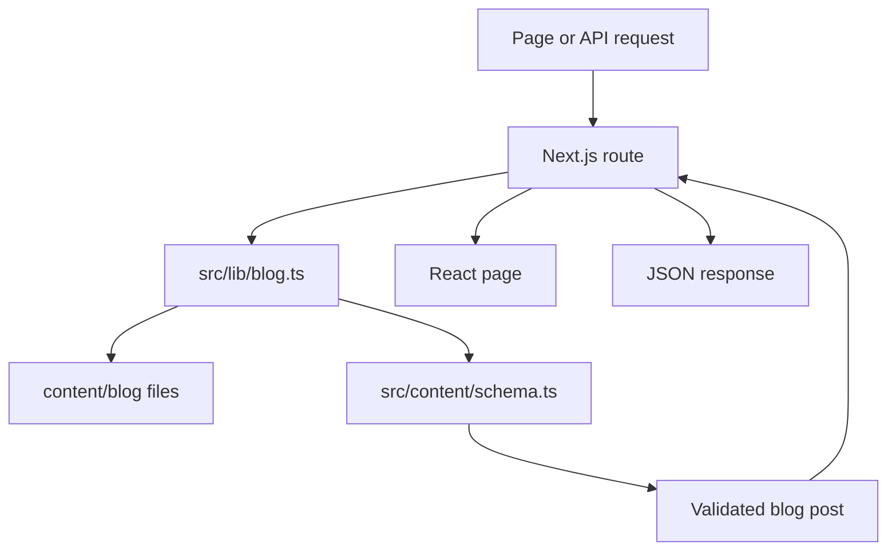

# Backend integration

This application uses Next.js App Router for pages and server endpoints. Blog content comes from files in the repository. There is no database, external content API, authentication service, proxy, or rewrite.

## Content flow

`src/lib/blog.ts` owns the blog data operations. It performs the following work.

- Accepts slugs made from lowercase letters, numbers, and hyphens.
- Reads `.mdx` and `.md` files from `content/blog/`.
- Parses YAML frontmatter with Gray Matter.
- Validates frontmatter with `BlogFrontmatterSchema`.
- Calculates reading time, word count, and a short excerpt.
- Excludes drafts from public lists.
- Sorts posts from newest to oldest.
- Filters posts by tag, category, or year.
- Paginates lists with the page size from `src/config/blog.ts`.

File and post caches live at module scope for the lifetime of the server process. Content is expected to stay unchanged after the application is built. Restart or rebuild the application after changing content.

## Server pages

Server components call the blog library directly. They do not call the HTTP API from the server.

| Route | Data source |
| --- | --- |
| `/blog` | Featured post and four recent posts |
| `/blog/all` | All published posts grouped in a timeline |
| `/blog/[slug]` | One post and its adjacent posts |
| `/blog/category/[category]/[page]` | Posts mapped to a configured category |
| `/blog/year/[year]/[page]` | Posts from one publication year |
| `/blog/tag/[tag]` | Posts with one exact tag |

`/blog/category/[category]` and `/blog/year/[year]` redirect to page 1. Unknown categories and invalid page values return the Next.js not-found page.

The dynamic post page renders MDX on the server with `next-mdx-remote`. It also builds article metadata, Open Graph metadata, breadcrumb structured data, reading navigation, and advertising placement.

## API routes

The route handlers under `src/app/api/blog/` expose read-only pagination for latest, category, and year queries. They call the same blog library as the server pages.

Use relative URLs such as `/api/blog/latest?page=2` from browser code. `next.config.js` does not define a separate API host or proxy.

See [Blog API](api.md) for the complete request and response contract.

## Search flow

Search uses a generated file instead of an API route.

```mermaid
sequenceDiagram
    participant Build as Build command
    participant Script as Search script
    participant File as search-index.json
    participant Browser as Search dialog

    Build->>Script: Run before dev or build
    Script->>File: Write non-draft post data
    Browser->>File: Fetch when search first opens
    Browser->>Browser: Build FlexSearch index
    Browser->>Browser: Return up to 10 unique posts
```

The generator in `scripts/generate-search-index.mjs` strips common Markdown syntax and writes title, subtitle, description, content, tags, date, and URL data. `src/hooks/useSearch.ts` downloads the file and indexes those fields in the browser.

## Other server routes

| Route | Purpose |
| --- | --- |
| `/og` | Generate an Open Graph image from `title` and comma-separated `tags` query values |
| `/robots.txt` | Serve crawler rules generated by `src/app/robots.ts` |
| `/sitemap.xml` | Serve static and blog URLs generated by `src/app/sitemap.ts` |

The Open Graph route downloads the configured author image from the current request origin. If that request fails, it renders the image without the avatar.

## Environment configuration

The app has no required runtime environment variables.

| Variable | Effect when set |
| --- | --- |
| `NEXT_PUBLIC_GOOGLE_ADSENSE_CLIENT_ID` | Loads AdSense and enables configured ad placements |
| `NEXT_PUBLIC_GOOGLE_ANALYTICS_TAG_ID` | Sets the Google Analytics script and tag ID |
| `ANALYZE=true` | Enables the bundle analyzer during a build |

Variables prefixed with `NEXT_PUBLIC_` are exposed to browser code. Never store secrets in them.

## Add a backend capability

1. Put shared content logic in `src/lib/` and define its types in `src/types/` when they are reused.
2. Validate file or request input before using it.
3. Add a route handler under `src/app/api/` only when browser or external HTTP access is needed.
4. Return a consistent JSON error and an appropriate HTTP status.
5. Add tests for valid input, invalid input, empty results, and failures.
6. Update [Blog API](api.md) when the public contract changes.

Keep server pages connected to shared library functions. This avoids an unnecessary internal HTTP request and keeps one source of truth for content behavior.
