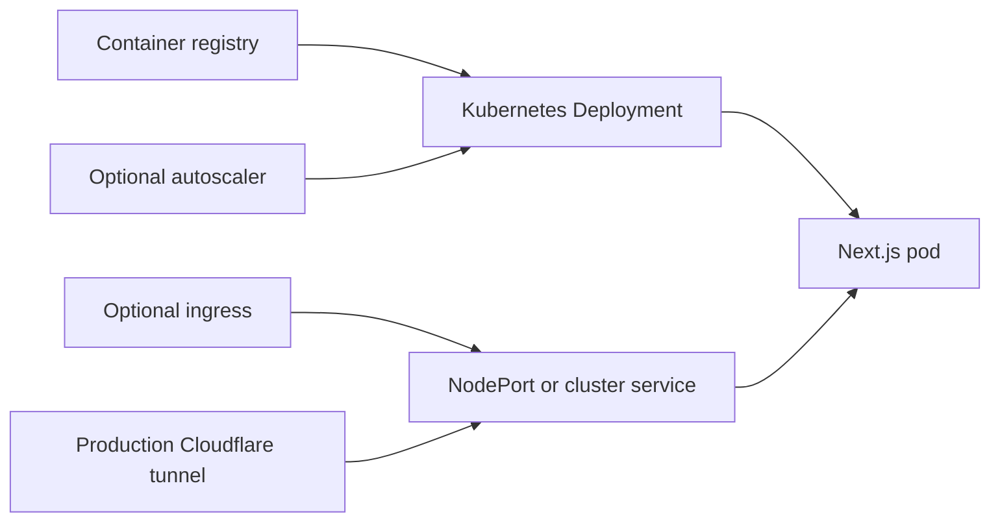

# Next.js Helm chart

This chart deploys the website as a Kubernetes `Deployment` and `Service`. It can also create a service account, ingress, horizontal pod autoscaler, and pod disruption budget.

## Requirements

- A Kubernetes cluster
- Helm 3
- `kubectl` access to the target namespace
- A container image that the cluster can pull
- An `imagePullSecret` named `ghcr-secret`, or an override of `imagePullSecrets`

The image tag must end with a hyphen and a full 40-character lowercase Git commit SHA. The chart rejects other formats.

```text
main-592c810961d06c9969c8504263e1ffb0b964685e
```

## Deployment model



The production and review workflows disable the chart ingress. They expose a NodePort through a Cloudflare tunnel. The chart ingress remains available for clusters that use an ingress controller.

## Validate the chart

Run the commands in this guide from the repository root. Use a valid placeholder tag when rendering or linting because tag validation runs inside the deployment template.

```bash
helm lint ./helm/nextjs-app \
  --set-string image.tag=local-0000000000000000000000000000000000000000

helm template nextjs-app ./helm/nextjs-app \
  --set-string image.tag=local-0000000000000000000000000000000000000000
```

## Install or upgrade

Set the registry image and immutable tag for every deployment.

```bash
helm upgrade --install nextjs-app ./helm/nextjs-app \
  --namespace personal-site \
  --create-namespace \
  --set-string image.repository=ghcr.io/yongchenglow/yongchenglow.com \
  --set-string image.tag=main-592c810961d06c9969c8504263e1ffb0b964685e \
  --wait \
  --timeout 10m
```

Use an environment values file when appropriate.

```bash
helm upgrade --install nextjs-app ./helm/nextjs-app \
  --namespace personal-site \
  --create-namespace \
  --values ./helm/nextjs-app/values-production.yaml \
  --set-string image.repository=ghcr.io/yongchenglow/yongchenglow.com \
  --set-string image.tag=main-592c810961d06c9969c8504263e1ffb0b964685e \
  --wait \
  --timeout 10m
```

`values-production.yaml` enables autoscaling and a pod disruption budget. `values-review.yaml` uses one replica without either feature. The review workflow overrides the NodePort for each pull request.

## Verify a release

```bash
helm status nextjs-app --namespace personal-site
kubectl get deployment,pod,service,hpa,pdb --namespace personal-site
kubectl rollout status deployment/nextjs-app \
  --namespace personal-site \
  --timeout=1m
```

For local access, forward the service port.

```bash
kubectl port-forward service/nextjs-app 8080:3000 \
  --namespace personal-site
```

Open [http://localhost:8080](http://localhost:8080).

## Main values

Defaults come from `values.yaml`.

| Value | Default | Purpose |
| --- | --- | --- |
| `replicaCount` | `2` | Fixed pod count when autoscaling is off |
| `image.repository` | `nextjs-frontend-template` | Container repository |
| `image.tag` | `latest` | Container tag, which must be overridden with a valid immutable tag |
| `image.pullPolicy` | `IfNotPresent` | Image pull behavior |
| `imagePullSecrets` | `[{name: ghcr-secret}]` | Registry credentials |
| `serviceAccount.create` | `true` | Create a service account for the pods |
| `service.type` | `NodePort` | Kubernetes service type |
| `service.port` | `3000` | Port exposed by the service |
| `service.targetPort` | `3000` | Container port targeted by the service |
| `ingress.enabled` | `false` | Create an ingress resource |
| `autoscaling.enabled` | `false` | Create a CPU and memory based autoscaler |
| `podDisruptionBudget.enabled` | `false` | Create a pod disruption budget |
| `resources.requests.cpu` | `250m` | Requested CPU per pod |
| `resources.requests.memory` | `512Mi` | Requested memory per pod |
| `resources.limits.cpu` | `500m` | CPU limit per pod |
| `resources.limits.memory` | `512Mi` | Memory limit per pod |
| `env` | `[]` | Explicit container environment variables |
| `envFrom` | `[]` | Environment variables from Secrets or ConfigMaps |

Read `values.yaml` for probe settings, scheduling controls, labels, annotations, naming overrides, and the full ingress structure.

## Configure ingress

The cluster must already have the selected ingress controller. TLS also requires the named secret or a controller that creates it from the annotations.

```yaml
ingress:
  enabled: true
  className: nginx
  annotations:
    cert-manager.io/cluster-issuer: letsencrypt-prod
  hosts:
    - host: app.example.com
      paths:
        - path: /
          pathType: Prefix
  tls:
    - secretName: app-example-tls
      hosts:
        - app.example.com
```

## Configure environment variables

Use `env` for non-sensitive values.

```yaml
env:
  - name: NODE_ENV
    value: production
```

Use a Kubernetes Secret for sensitive values and load it with `envFrom`.

```yaml
envFrom:
  - secretRef:
      name: nextjs-secrets
```

Values with a `NEXT_PUBLIC_` prefix can be included in browser bundles. Do not use that prefix for secrets.

## Health and security defaults

The startup, readiness, and liveness probes request `/` on container port `3000`. You can replace or disable each probe in a values file.

The default pod and container configuration has these controls.

- Run as user `65532` with filesystem group `65532`.
- Require a non-root user.
- Block privilege escalation.
- Drop every Linux capability.
- Use a read-only root filesystem.
- Mount writable temporary volumes at `/tmp` and `/app/.next/cache`.

The runtime container intentionally has no shell. Use logs, events, and a separate debug container for investigation.

## Roll back or remove a release

List the available revisions before a rollback.

```bash
helm history nextjs-app --namespace personal-site
REVISION=2
helm rollback nextjs-app "$REVISION" --namespace personal-site --wait --timeout 10m
```

Remove the release when it is no longer needed.

```bash
helm uninstall nextjs-app --namespace personal-site
```

This removes resources managed by the release. It does not remove the namespace or registry secret.

## Troubleshooting

```bash
kubectl get events --namespace personal-site --sort-by=.lastTimestamp
kubectl describe deployment/nextjs-app --namespace personal-site
kubectl describe pod --selector app.kubernetes.io/name=nextjs-app \
  --namespace personal-site
kubectl logs --selector app.kubernetes.io/name=nextjs-app \
  --namespace personal-site \
  --all-containers
```

Common causes are an invalid image tag, a missing `ghcr-secret`, an unavailable image, insufficient cluster resources, or a failing root-path probe.
